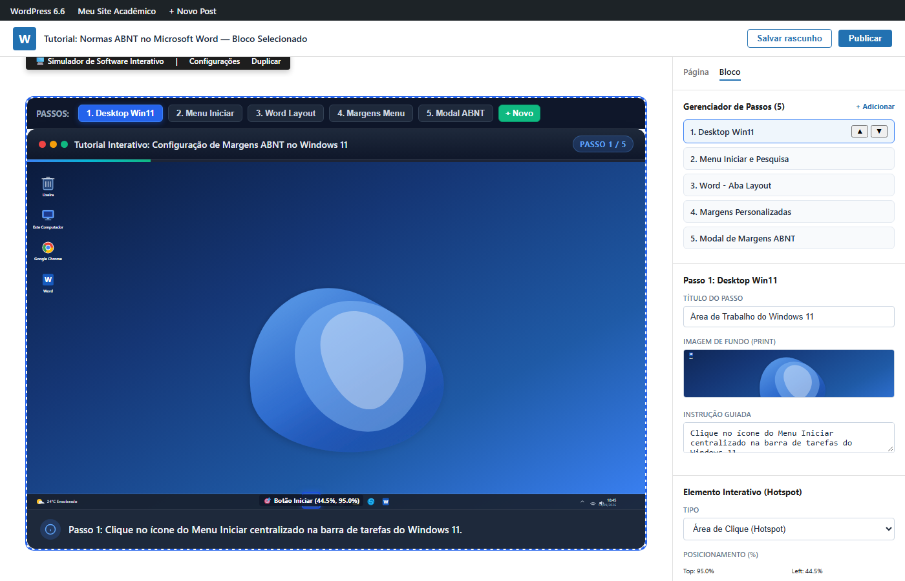
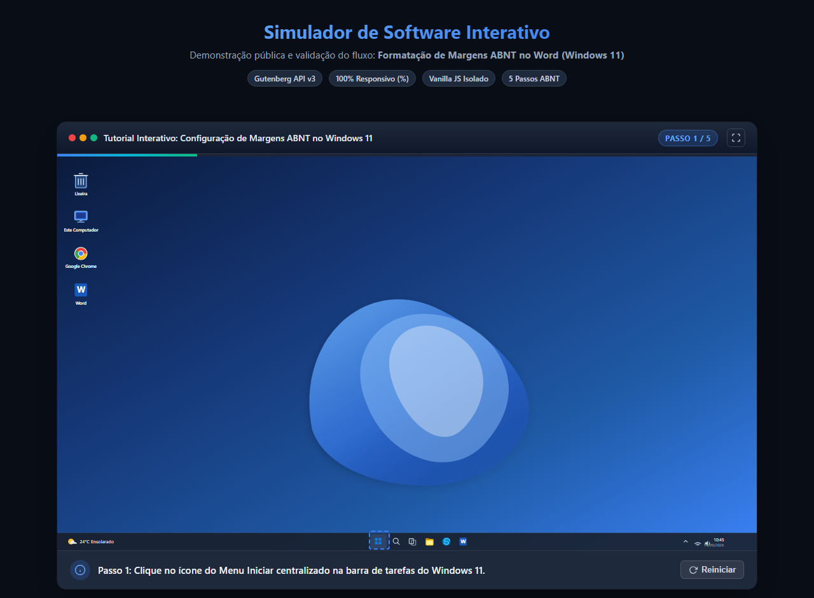
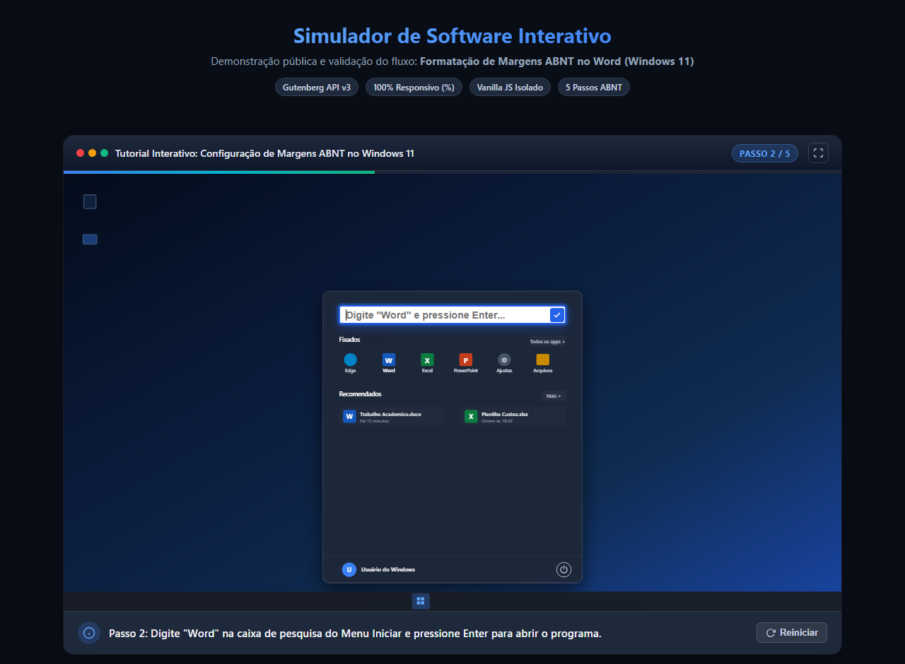
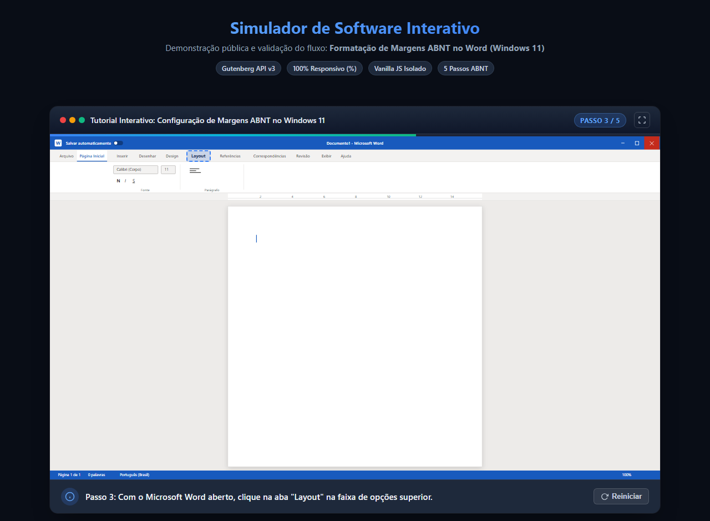
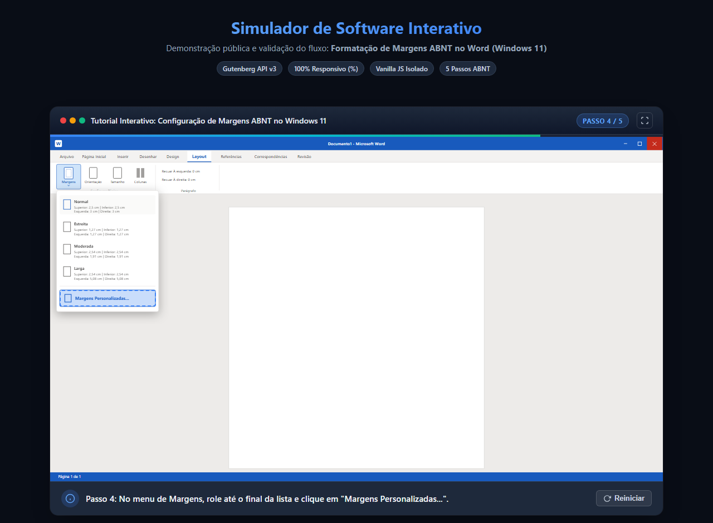
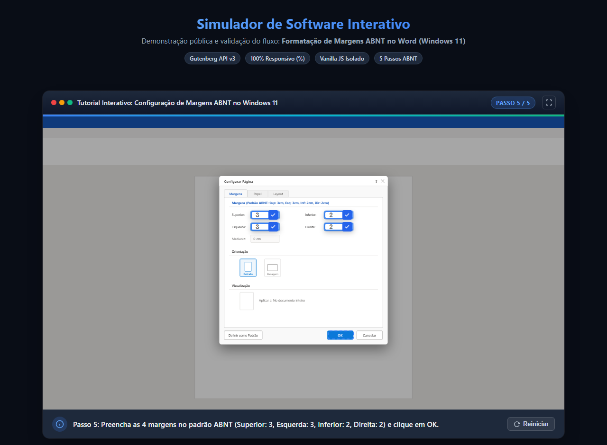
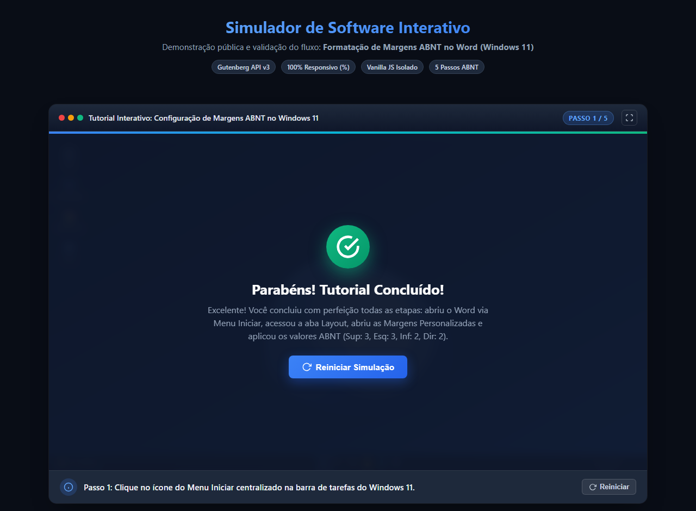
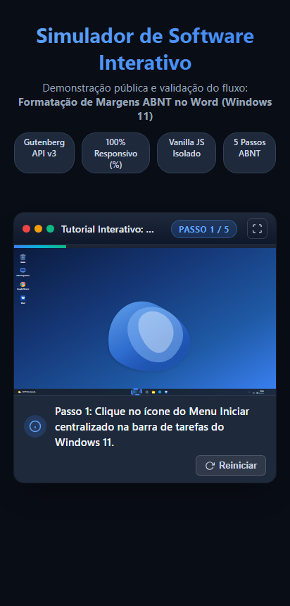

<!--
  Module: periodic-interative-software-simulator
  Consolidated under: Periodic Component Suite
  Consolidation date: 2026-09-15
-->

# Periodic Interative Software Simulator

> Consolidated module standardized under namespace `.periodic-interative-software-simulator`.

[English](interative-software-simulator.md) • [Português (BR)](i18n/interative-software-simulator.pt-br.md) • [Español](i18n/interative-software-simulator.es.md) • [Italiano](i18n/interative-software-simulator.it.md)

---

# Simulador de Software Interativo (WordPress Gutenberg Block)

[](https://wordpress.org)
[](https://developer.wordpress.org/block-editor/)
[](https://developer.mozilla.org/en-US/docs/Web/JavaScript)
[-orange.svg)]()
[](LICENSE)

O **Simulador de Software Interativo** (`custom/simulador-software`) é um bloco Gutenberg nativo de alta performance para WordPress projetado para criar **tutoriais práticos guiados passo a passo simulando softwares reais** (como Windows 11, Microsoft Word, Excel, painéis SaaS, sistemas operacionais e ferramentas web).

O bloco permite enviar capturas de tela (prints) em alta resolução e desenhar camadas interativas responsivas (áreas de clique com pulso visual, caixas de digitação com validação instantânea, drag & drop, imagens animadas e eventos avançados de teclado e mouse).

---

## 🖱️ Suporte Completo a Mouse Avançado, Scroll e Teclas Modificadoras

As camadas interativas do tipo **Clique / Mouse** suportam personalização completa de botões físicos, rolagens de scroll e combinações com teclas modificadoras:

### 1. Botões e Ações Suportadas
- **Botão Primário (Esquerdo)** (`button: 0`): Clique padrão de seleção e avanço.
- **Botão Secundário (Direito)** (`button: 2`): Abre menus de contexto ou simula cliques com botão direito (`contextmenu`).
- **Botão do Meio / Scroll Click** (`button: 1`): Clique da roda de rolagem do mouse (`auxclick`).
- **Rolagem do Scroll para Cima (`scroll-up`)**: Evento `wheel` com `deltaY` negativo (-100).
- **Rolagem do Scroll para Baixo (`scroll-down`)**: Evento `wheel` com `deltaY` positivo (+100).

### 2. Teclas Modificadoras Opcionais
Qualquer ação de mouse pode ser combinada com uma ou mais teclas modificadoras:
- `[Ctrl]` (`ctrlKey: true`)
- `[Shift]` (`shiftKey: true`)
- `[Alt]` (`altKey: true`)

Exemplos práticos:
- `Ctrl + Clique Primário` (Seleção múltipla ou abrir em segundo plano)
- `Shift + Clique Primário` (Seleção de intervalo contíguo)
- `Ctrl + Scroll Up` / `Ctrl + Scroll Down` (Simulação de zoom in/out)

### 3. Exemplos de Simulação de Eventos
```javascript
// Exemplo A: Control + Clique Primário
function simularCliqueComModificador(elementoAlvo, botao = 0, mod = { ctrl: false, shift: false, alt: false }) {
  const eventoMouse = new MouseEvent('click', {
    bubbles: true,
    cancelable: true,
    view: window,
    button: botao, // 0 = Primário (Esquerdo), 1 = Meio, 2 = Direito
    buttons: botao === 2 ? 2 : (botao === 1 ? 4 : 1),
    ctrlKey: mod.ctrl,
    shiftKey: mod.shift,
    altKey: mod.alt
  });
  elementoAlvo.dispatchEvent(eventoMouse);
}

// Exemplo B: Ctrl + Scroll Up / Scroll Down
function simularScrollComModificador(elementoAlvo, direcao = 'up', mod = { ctrl: false, shift: false, alt: false }) {
  const deltaY = direcao === 'up' ? -100 : 100; // Negativo para cima, positivo para baixo
  const eventoWheel = new WheelEvent('wheel', {
    bubbles: true,
    cancelable: true,
    view: window,
    deltaY: deltaY,
    deltaMode: 0,
    ctrlKey: mod.ctrl,
    shiftKey: mod.shift,
    altKey: mod.alt
  });
  elementoAlvo.dispatchEvent(eventoWheel);
}
```

---

## ⌨️ Interação Exclusiva de Teclado ("+ Teclado")

O botão **`+ Teclado`** disponível no painel de camadas interativas permite cadastrar eventos exclusivos de atalhos e teclas de computador para reproduzir com fidelidade a operação de softwares:

### 1. Configuração e Interface Visual
- **Teclas Modificadoras**: Checkboxes para `[Ctrl]`, `[Shift]`, `[Alt]`.
- **Seletor de Teclas Categorizado**:
  - **Teclas Alfanuméricas**: Letras (`A-Z`) e Números (`0-9`).
  - **Teclas de Função**: `F1` até `F12`.
  - **Teclas de Navegação e Edição**: `Home`, `End`, `Delete`, `Page Up`, `Page Down`, Setas direcionais (`ArrowUp`, `ArrowDown`, `ArrowLeft`, `ArrowRight`), `Enter`, `Tab`, `Escape`, `Space`, `Backspace`.
- **Pré-visualização em Tempo Real**: Exibe a combinação exata configurada (ex: `Ctrl + Shift + Alt + T`).

### 2. Combinações e Atalhos Suportados
- `Ctrl + C` (Copiar)
- `Ctrl + T` (Nova aba)
- `Alt + A`
- `Shift + Seta a Direita` (Seleção de texto)
- `F1` até `F12` (Ajuda, tela cheia, renomear, atualizar)
- `Shift + Delete` (Exclusão permanente)
- `Ctrl + Home` / `Ctrl + End` (Início / Fim de documento)
- `Shift + Page Up`
- **Combinação Complexa**: `Ctrl + Shift + Alt + T`

### 3. Execução e Disparo em Tempo Real
No frontend, o simulador escuta o evento global `keydown` durante o passo ativo e valida as teclas físicas pressionadas. Ao reconhecer o atalho, dispara a sequência simulada e avança imediatamente de etapa com feedback auditivo e tátil. Adicionalmente, um card visual estilizado com `<kbd>` permite que usuários em dispositivos móveis ou com leitores de tela toquem para acionar a simulação.

```javascript
function simularAtalhoTeclado(elementoAlvo, config = { key: 'T', code: 'KeyT', ctrl: false, shift: false, alt: false }) {
  const init = {
    key: config.key,
    code: config.code || `Key${config.key.toUpperCase()}`,
    bubbles: true,
    cancelable: true,
    view: window,
    ctrlKey: !!config.ctrl,
    shiftKey: !!config.shift,
    altKey: !!config.alt
  };
  const downEvent = new KeyboardEvent('keydown', init);
  elementoAlvo.dispatchEvent(downEvent);
  setTimeout(() => {
    const upEvent = new KeyboardEvent('keyup', init);
    elementoAlvo.dispatchEvent(upEvent);
  }, 40);
}
```

---

---

## 📸 Galeria de Telas e Demonstração

### Painel de Edição (Gutenberg Canvas & Inspector)
Gerenciador lateral completo de passos, upload de imagens via Media Library, configurações de instrução e posicionamento em porcentagem (`%`):


---

### Passo 1: Área de Trabalho do Windows 11
O aluno visualiza a área de trabalho realista e deve clicar no ícone centralizado do Menu Iniciar:


---

### Passo 2: Menu Iniciar com Barra de Pesquisa
Menu Iniciar aberto no estilo Fluent Design. O usuário digita `"Word"` e pressiona `Enter`:


---

### Passo 3: Microsoft Word Aberto
Interface do Microsoft Word com documento em branco. O usuário clica na aba **Layout** na faixa de opções:


---

### Passo 4: Menu de Margens na Faixa de Opções
Menu suspenso de margens aberto. O usuário clica na opção **Margens Personalizadas...**:


---

### Passo 5: Configuração das Margens no Padrão ABNT
Modal **Configurar Página** com 4 campos de digitação (Superior: 3, Esquerda: 3, Inferior: 2, Direita: 2) e clique de confirmação no botão **OK**:


---

### Conclusão com Sucesso & Responsividade Mobile
Tela comemorativa de conclusão do tutorial com opção de reiniciar e adaptação fluida para dispositivos móveis:

| Conclusão com Sucesso | Visualização em Dispositivo Móvel |
| :---: | :---: |
|  |  |

---

## ✨ Principais Funcionalidades

- **Coordenadas 100% Responsivas por Porcentagem (`%`)**: Todos os hotspots e campos de input utilizam `top`, `left`, `width` e `height` em `%`. A simulação funciona com precisão cirúrgica em celulares, tablets, notebooks e telas 4K.
- **Frontend Ultraleve em Vanilla JavaScript**: Zero dependências pesadas no lado do cliente. Carregamento instantâneo, seguro e em conformidade com as diretrizes do WordPress Core.
- **Isolamento de Estado (Multi-Instance)**: Cada bloco inserido na página opera em seu próprio escopo, permitindo múltiplos simuladores na mesma postagem sem colisão de variáveis.
- **Validação Inteligente de Digitação**: Compara o texto inserido com o `expectedValue` esperado (case-insensitive, tolerante a formatações como `"3"` ou `"3 cm"`).
- **Feedback Tátil & Visual**:
  - Pulso suave de destaque nas áreas clicáveis.
  - Efeito sonoro/ondulação de clique bem-sucedido.
  - Animação de vibração (*shake*) e aviso flutuante (*toast*) ao errar ou clicar fora da área indicada.
- **Suporte Multi-Input com Botão de Confirmação**: Suporta etapas com múltiplos campos preenchíveis simultaneamente (como a janela modal de margens ABNT).
- **Modo Tela Cheia**: Suporte nativo à Fullscreen API com adaptação automática de proporção.
- **Internacionalização Completa (`languages/`)**:
  - 🇧🇷 Português do Brasil (`pt-br.json`)
  - 🇺🇸 Inglês (`en-us.json`)
  - 🇮🇹 Italiano (`it.json`)
  - 🇪🇸 Espanhol (`es.json`)
- **Cenário de Exemplo Embutido**: Já vem pré-carregado com o fluxo completo de **Formatação de Margens ABNT no Windows 11** com ilustrações vetoriais SVG de altíssima fidelidade.

---

## 📁 Estrutura de Arquivos do Plugin

```plaintext
interative-software-simulator/
├── interative-software-simulator.php       # Arquivo de inicialização do plugin WordPress
├── block.json                              # Metadados do bloco (Gutenberg API v3)
├── package.json                            # Scripts de build do @wordpress/scripts
├── webpack.config.js                       # Configuração de compilação
├── languages/                              # Arquivos de tradução i18n
│   ├── pt-br.json                          # Português (Brasil)
│   ├── en-us.json                          # Inglês
│   ├── it.json                             # Italiano
│   └── es.json                             # Espanhol
├── assets/                                 # SVGs de alta definição para o fluxo ABNT
│   ├── step1-windows11-desktop.svg
│   ├── step2-windows11-startmenu.svg
│   ├── step3-word-document.svg
│   ├── step4-word-layout-ribbon.svg
│   └── step5-word-margins-modal.svg
├── inc/
│   ├── frontend-handler.php                # Helpers de URL e tradução
│   └── render.php                          # Renderizador dinâmico do bloco no frontend
├── src/
│   ├── index.js                            # Ponto de entrada do bloco
│   ├── edit.js                             # Componente React Edit (Inspector & Canvas)
│   ├── save.js                             # Serialização HTML e dados JSON
│   ├── view.js                             # Script frontend Vanilla JS (classe SoftwareSimulator)
│   ├── editor.scss                         # Estilos do editor Gutenberg
│   ├── style.scss                          # Estilos do frontend e animações
│   └── default-data.js                     # Configurações do cenário padrão ABNT
├── screenshots/                            # Capturas de tela para documentação
└── README.md                               # Este manual completo
```

---

## 🚀 Instalação e Ativação

### Método 1: Instalação Manual no WordPress
1. Baixe ou clone esta pasta para dentro do diretório de plugins da sua instalação WordPress:
   ```bash
   wp-content/plugins/interative-software-simulator
   ```
2. Instale as dependências e compile os assets:
   ```bash
   cd wp-content/plugins/interative-software-simulator
   npm install
   npm run build
   ```
3. Acesse o painel do WordPress em **Plugins > Plugins Instalados** e clique em **Ativar** no **Simulador de Software Interativo**.

### Método 2: Teste Standalone no Navegador
Para testar a simulação sem precisar de uma instalação ativa do WordPress:
1. Abra diretamente o arquivo `test-preview.html` em qualquer navegador web moderno.
2. O simulador inicializará instantaneamente com todos os 5 passos do fluxo ABNT no Windows 11.

---

## 🛠️ Comandos de Desenvolvimento

| Comando | Descrição |
| :--- | :--- |
| `npm run build` | Compila o bundle de produção otimizado em `build/` |
| `npm run start` | Inicia o compilador em modo de desenvolvimento com hot-reload |
| `npm run lint:js` | Valida as regras de código JavaScript |
| `npm run lint:css` | Valida e padroniza os estilos SCSS/CSS |

---

## ⚙️ Especificação dos Atributos (`attributes`)

| Atributo | Tipo | Padrão | Descrição |
| :--- | :--- | :--- | :--- |
| `simulatorTitle` | `string` | `"Simulador de Software Interativo"` | Título exibido na barra superior da janela |
| `steps` | `array` | `[...]` | Lista dinâmica de passos contendo imagens, instruções e elementos |
| `showProgressBar` | `boolean` | `true` | Exibe a barra de progresso gradiente no topo |
| `showRestartButton` | `boolean` | `true` | Permite reiniciar a simulação a qualquer momento |
| `showStepIndicator` | `boolean` | `true` | Exibe o contador (ex: "Passo 1 / 5") |
| `highlightHints` | `boolean` | `true` | Ativa o pulso luminoso nos hotspots interativos |
| `customSuccessMessage` | `string` | `Mensagem padrão` | Texto exibido na tela final de parabéns |

### Estrutura de um Passo (`step`)
```json
{
  "id": "step-1",
  "title": "Título descritivo do passo",
  "imageUrl": "https://meusite.com/imagem.png",
  "instruction": "Instrução exibida na barra inferior.",
  "elements": [
    {
      "id": "el-1",
      "type": "click",
      "top": 95.0,
      "left": 44.5,
      "width": 3.0,
      "height": 4.8,
      "label": "Botão Iniciar",
      "targetStepIndex": 1
    }
  ]
}
```

---

## 📜 Licença

Distribuído sob a licença **GPLv2 ou posterior**. Consulte o arquivo [LICENSE](LICENSE) para obter detalhes.
